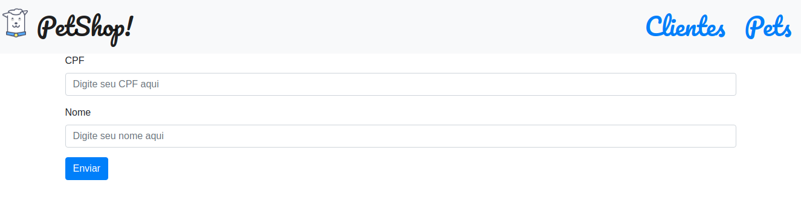

## Prints das telas desenvolvidas

<h1 align="center">
    
    
    
</h1>


## 🔖 Sobre
Webpack: Manipulando módulos na sua webapp.

 - Trabalhando o module bundler mais popular do mercado.
 - Diferencie o build de desenvolvimento do build de produção.
 - Aprenda a aplicar técnicas como o lazy loading e o code splitting.
 - Seja mais produtivo como Webpack Dev Server.
 - Separe sua aplicação em diferentes bundles.
 - Aplique na prática as boas práticas seguidas pela comunidade.

---

# [I][n][d][i][c][e]

- [Sobre](#-sobre)
- [Tecnologias Utilizadas](#-tecnologias-utilizadas)
- [Como baixar o projeto](#-como-baixar-o-projeto)

---

## 🚀 Tecnologias utilizadas

O projeto foi desenvolvido utilizando as seguintes tecnologias

- [HTML](https://developer.mozilla.org/pt-BR/docs/Web/HTML)
- [JavaScript](https://developer.mozilla.org/pt-BR/docs/Aprender/JavaScript)

---

## 🎓 Quem ministrou?

Plataforma Alura.com


## 🗂 Como baixar o projeto

```sh

    # Clonar o repositório
    $ git clone https://github.com/CleytonPinheiro/webpack-js-alura
```

```sh
    # Entrar no diretório
    $ na raiz do projeto
```

```sh
     #Instalar as dependências usados no projeto
     $ npm install
```
```sh
    #Build do projeto:
    $ npm run build
```
```sh
    #Subir o servidor local, digitando o comando:
    $ npm start
```

```sh
    # Iniciar o projeto
    $ abrir no navegador: localhost:3000
```
## Baixar e instalar a api usado no projeto

```sh
    # Dento da raiz do projeto, acessar server-petshop
    $ /raiz-do-projeto/ cd server-petshop
```

```sh
     #Instalar as dependências usados no projeto
     $ npm install
```

```sh
    #Subir o servidor local, digitando o comando:
    $ npm start
```
```sh
    # Verificar servidor do api
    $ abrir no navegador: localhost:4000
```

---
